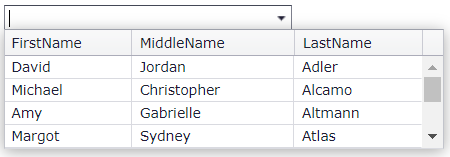

<!-- default badges list -->
[](https://supportcenter.devexpress.com/ticket/details/E4383)
[](https://docs.devexpress.com/GeneralInformation/403183)
<!-- default badges end -->
# Combo Box for ASP.NET MVC - How to filter a large data source and automatically select the first item
<!-- run online -->
**[[Run Online]](https://codecentral.devexpress.com/e4383/)**
<!-- run online end -->

This example demonstrates how to use the combo box editor's [BindList](https://docs.devexpress.com/AspNetMvc/DevExpress.Web.Mvc.ComboBoxExtension.BindList.overloads) method to bind the editor to a large filtered data source.



## Overview

Use the editor's [BindList](https://docs.devexpress.com/AspNetMvc/DevExpress.Web.Mvc.ComboBoxExtension.BindList.overloads) method and pass the following methods as parameters:

* A delegate method of the [ItemsRequestedByFilterConditionMethod](https://docs.devexpress.com/AspNetMvc/DevExpress.Web.Mvc.ItemsRequestedByFilterConditionMethod) type. This method allows you to implement custom item selection based on filter conditions.

* A delegate method of the [ItemRequestedByValueMethod](https://docs.devexpress.com/AspNetMvc/DevExpress.Web.Mvc.ItemRequestedByValueMethod) type. This method allows you to implement custom item selection based on items' values.

```cshtml
var comboBox = Html.DevExpress().ComboBox(settings => {
    settings.Name = "comboBox";
    <!-- ... -->
}).BindList(ComboBoxLargeDataBase.Model.DataHelper.GetPersonsRange, ComboBoxLargeDataBase.Model.DataHelper.GetPersonByID);
```

```cs
public static object GetPersonsRange(ListEditItemsRequestedByFilterConditionEventArgs args) {
    var skip = args.BeginIndex;
    var take = args.EndIndex - args.BeginIndex + 1;
    return (from person in DataHelper.Persons
            where (person.FirstName + " " + person.MiddleName + " " + person.LastName).ToLower().Contains(args.Filter.ToLower())
            orderby person.LastName
            select person
        )
        .Skip(skip)
        .Take(take);
}
public static object GetPersonByID(ListEditItemRequestedByValueEventArgs args) {
    if(args.Value != null)
        return GetPersonByID((int)args.Value);
    return null;
}
```

When a single item remains available after filter operations, the editor's [SetSelectedIndex](https://docs.devexpress.com/AspNet/js-ASPxClientComboBox.SetSelectedIndex(index)) method automatically selects it in the editor's client-side [EndCallback](https://docs.devexpress.com/AspNet/js-ASPxClientComboBox.EndCallback) event handler.

## Files to Review

* [HomeController.cs](./CS/ComboBoxLargeDataBase/Controllers/HomeController.cs) (VB: [HomeController.vb](./VB/ComboBoxLargeDataBase/Controllers/HomeController.vb))
* [MyModel.cs](./CS/ComboBoxLargeDataBase/Model/MyModel.cs) (VB: [MyModel.vb](./VB/ComboBoxLargeDataBase/Model/MyModel.vb))
* [ComboBoxPartial.cshtml](./CS/ComboBoxLargeDataBase/Views/Home/ComboBoxPartial.cshtml)
* [Index.cshtml](./CS/ComboBoxLargeDataBase/Views/Home/Index.cshtml)

## More Examples

* [Combo Box - Custom Binding](https://demos.devexpress.com/MVCxDataEditorsDemos/Editors/LargeDataComboBox)
